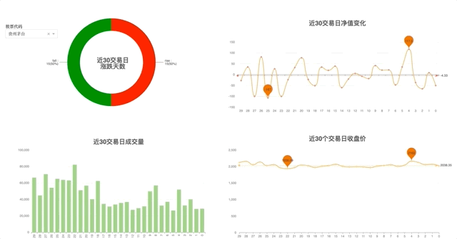
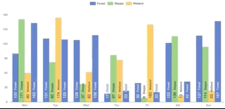
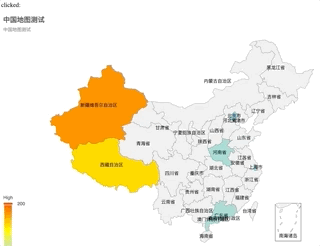
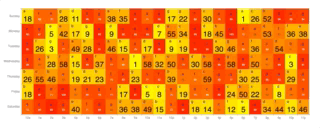
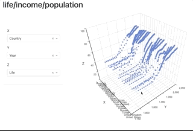
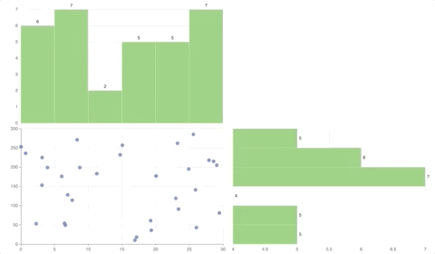

# dash_echarts

## gallery

if you install it via `pip install 'dash_echarts[play]'`, 
you can run the command `echarts_play` to see the gallery demo! 


## demo



## try it out

step 1. run command

```
pip install 'dash_echarts[play]'
```

step 2. run command

```
echarts_line
```

step 3. access url

```
http://127.0.0.1:8050/
```


step 4. explore others

run other commands

```
echarts_play
echarts_bar
echarts_heat
echarts_map
echarts_scatter3d
echarts_histbar
echarts_regression
echarts_customprofit
echarts_line_race
echarts_bar_race
echarts_bar_style
```












> contact the author for commercial dashboard support!

## how to install

```bash
pip install dash_echarts
```

## release notes

- 0.0.12 fix bugs of resizing events, add a gallery demo
  - this will be the last version before the 0.1.0
  - the gallery app is now in alpha
- 0.0.11 fix bugs of echarts' event not updating the dash components, use click_data for receiving event from echarts 
- 0.0.10 remove dependencies of echarts-for-react, enable mapbox-gl!
  notes: remove deprecated events for versions after 0.0.9
- 0.0.9 enable baidu bmap & add echarts_air example
- 0.0.8 enchance funs & add ecStat support
- 0.0.7(0.0.6) add funs, fun_keys, fun_paths & disable fun_formatter
- 0.0.5 add fun_formatter(testing) feature & gl support & more examples
- 0.0.4 add map demo
- 0.0.3 first mvp

## full example

```python
import dash_echarts
import dash, random
from dash.dependencies import Input, Output
import dash_html_components as html
import dash_core_components as dcc
from dash.exceptions import PreventUpdate


def gen_randlist(num):
    return random.sample(range(num), 7)


def main():
    '''
    dash_echarts examples
    name: smooth line with echarts
    author: dameng <pingf0@gmail.com>
    '''
    app = dash.Dash(__name__)

    option =  {
        'xAxis': {
            'type': 'category',
            'data': ['Mon', 'Tue', 'Wed', 'Thu', 'Fri', 'Sat', 'Sun']
        },
        'yAxis': {
            'type': 'value'
        },
        'series': [{
            'data': gen_randlist(200),
            'type': 'line',
            'smooth': True
        }, {
            'data': gen_randlist(200),
            'type': 'line',
            'smooth': True
        }]
    } 

    app.layout = html.Div([
        dash_echarts.DashECharts(
            option = option,
            id='echarts',
            style={
                "width": '100vw',
                "height": '100vh',
            }
        ),
        dcc.Interval(id="interval", interval=1 * 1000, n_intervals=0),
    ])


    @app.callback(
        Output('echarts', 'option'),
        [Input('interval', 'n_intervals')])
    def update(n_intervals):
        if n_intervals == 0:
            raise PreventUpdate
        else:
            option['series'][0]['data'] = gen_randlist(200)
            option['series'][1]['data'] = gen_randlist(200)
        return option
    app.run_server(debug=True)

if __name__ == '__main__':
    main()
```
